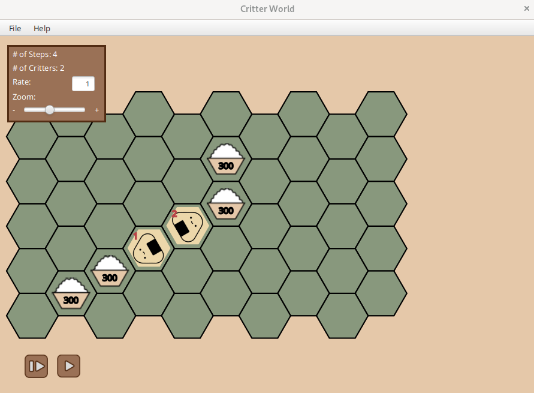
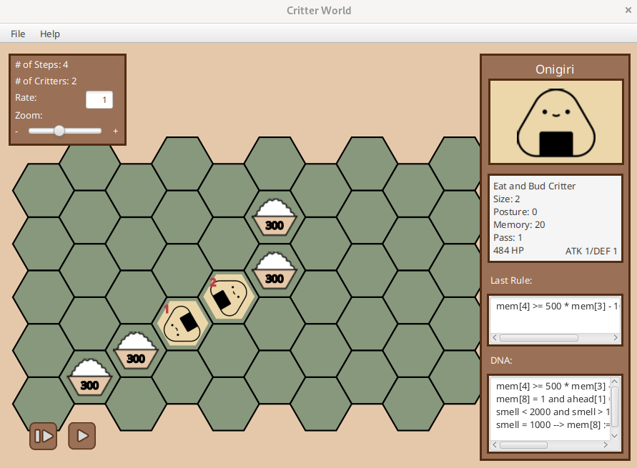
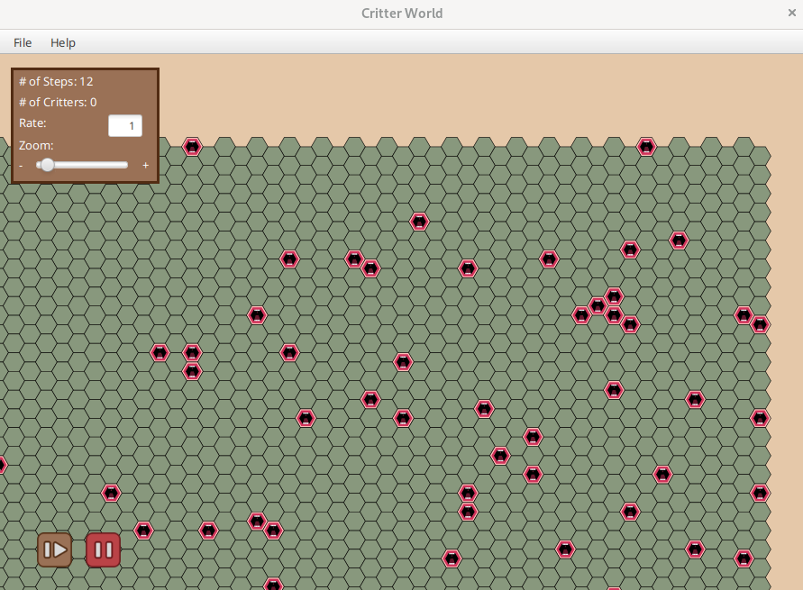

# Critter World
This stub repository is a write-up for our CS 2112 project Critter World. For reasons of academic integrity, the source code cannot be published publicly.

## Team
Jonathan Chen

Žiga Kovačič

Luke Tao

## Implementation

Our first task was to design a recursive descent parser for the grammar of a "critter" programming language specified in the project spec below.

Project spec: https://www.cs.cornell.edu/courses/cs2112/2022fa/project/project.pdf?1668394201

We then had to write an interpreter for the critter programming language. These interpreted programs defined the behavior of critters in a simulated world. 

Finally, we designed a modern GUI in JavaFX to allow the user to interact with the world. Features included zooming, panning, and intuitive controls for clicking on critters and fast-forwarding the world simulation.

## Images

Example world with critters and food. The color scheme and theming is based on the food onigiri.

Interface when a critter is clicked, displaying its attributes and its program DNA.

Example large world with obstacles.

